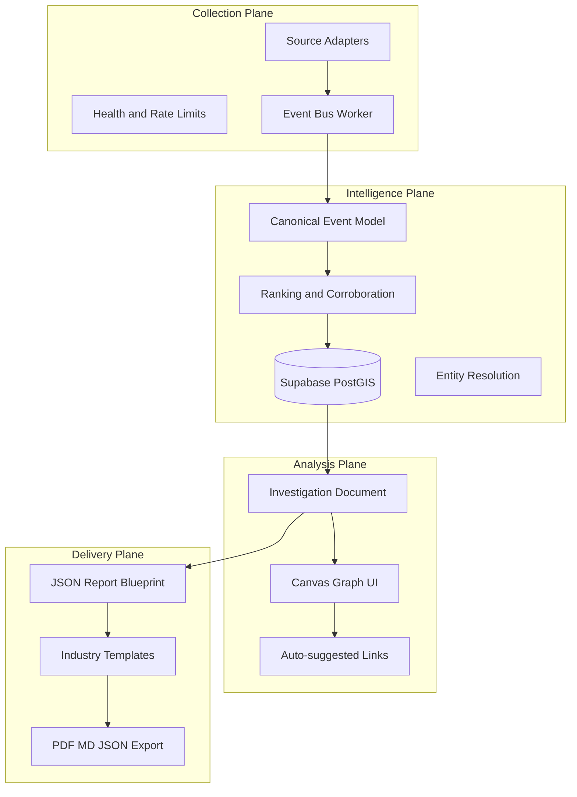
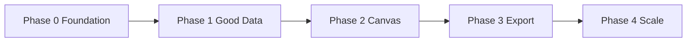
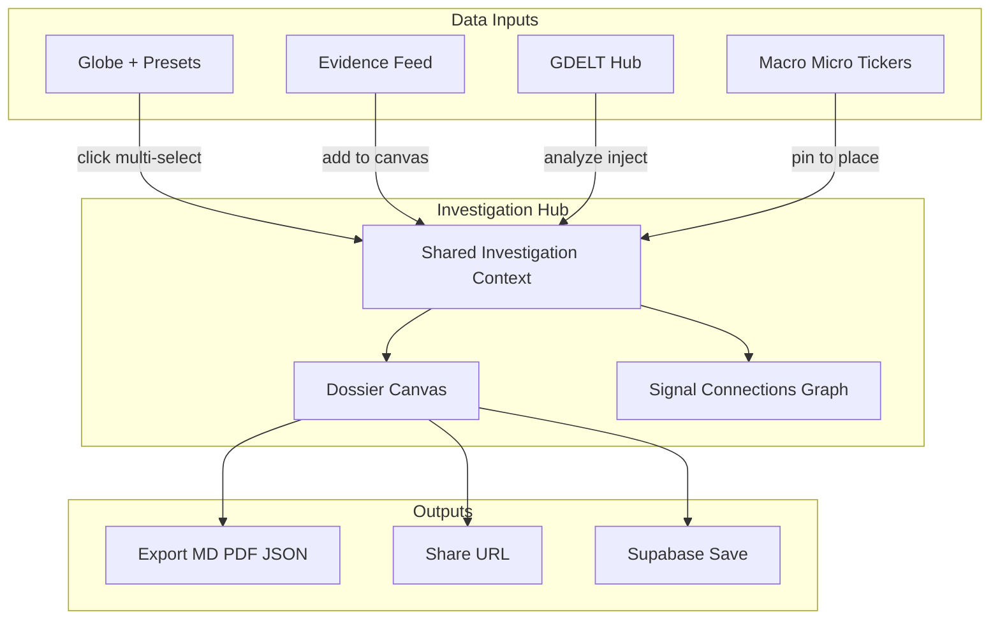

# ATLAS Analyst Platform — Layer Strategy + Problems Audit

> **Overview:** Evolve ATLAS into an analyst workstation using a four-plane architecture (Collection → Intelligence → Analysis → Delivery), source adapters on a canonical event model, investigation canvas for insight derivation, and industry report templates — built incrementally on the existing Vite/React/Vercel stack.

This plan extends the prior ATLAS Layer Strategy with a validated problems audit. The north star shifts from "layer toggles on a globe" to **analyst workflow**: view events → select signals → build a dossier canvas → export/save.

**Related docs:** [ATLAS_VISION.md](../../ATLAS_VISION.md) · [RESOURCES.md](../RESOURCES.md)

---

## Implementation checklist

| Phase | ID | Task | Status |
|-------|-----|------|--------|
| 0 | platform-foundation | Formalize four-plane architecture; extract SourceAdapter interface; schema validation + health fitness checks | Pending |
| 0 | audit-quick-wins | Source-aware marker icons, choropleth tone legend, GDELT Analyze error states, priority labels, layer groups + presets | Pending |
| 1 | data-reliability | Tiered source catalog (A/B/C), GDELT proxy, foundational defaults, session backfill, provenance on event cards | Pending |
| 1 | intelligence-plane | Supabase persistence; entity resolution MVP; cross-source corroboration merge | Pending |
| 2 | investigation-store | Investigation document model; globe multi-select; Add-to-canvas | Pending |
| 2 | dossier-canvas | React Flow investigation canvas; auto-suggested links; GDELT Hub scoped to investigation | Pending |
| 2 | feed-redesign | Evidence Stream scoped to active investigation with provenance chips | Pending |
| 3 | report-engine | JSON blueprint + Handlebars industry templates + PDF export API | Pending |
| 3 | macro-tickers | Indicator adapters (World Bank/FRED/Finnhub) + per-place HUD ticker | Pending |
| 3 | design-system | Design tokens, SVG glyphs, unified panel chrome, print/export stylesheet | Pending |

---

## Problems Audit (validated)

### Data

| Problem | Root cause in code | Severity |
|---------|-------------------|----------|
| **GDELT Analyze not working** | `GDELTAnalyticsPanel.jsx` calls `fetchGdeltAnalyticsBundle` which depends on GDELT DOC + BigQuery (`bigqueryService.js`). Without `GOOGLE_CLOUD_CREDENTIALS` + `GOOGLE_CLOUD_PROJECT`, historical/network/stability tabs fail silently. DOC calls compete on client-side `gdeltHttp.js` Web Lock (5.5s). | High |
| **GDELT ecosystem confusing, no system** | Four disconnected pipelines: CAMEO CSV (choropleth + pins), DOC (feed), GEO (heatmap), BigQuery (analytics/dossier). No single "GDELT hub" UX. | High |
| **All event layers show Green Leaf** | Globe sprites encode **dimension only** (`visualGrammar.js` → `DIMENSION_ICONS.environment = '🌿'`). Authoritative feeds hardcode `dimension: 'environment'` in `fetchManager.worker.js` (USGS, GDACS, FIRMS, EONET, NHC). | High |
| **Country tone + heatmap not working / vague** | Choropleth works via in-worker CAMEO aggregates (`useGdeltGeoOverlay.js`) — but tone values have no on-globe legend. Heatmap calls GDELT GEO API which returns **404**. | High |
| **API slow, not enough globe data** | Worker polls 40+ sources; most are ticker-only per `globeLayers.js`. Only ~6 sources reliably plot pins without keys. No session backfill. | High |
| **Flight data biased (US/Europe dark elsewhere)** | `opensky-states.js` fetches adsb.lol global endpoint — coverage follows ADS-B receiver density, not API bug. | Medium |
| **Working APIs** | USGS, GDACS, EONET, FIRMS (with `VITE_FIRMS_MAP_KEY`) | Baseline |
| **Not working APIs (user report)** | Hurricanes: opt-in default. Field layers: heatmap broken; wind/GIBS Globe.GL-only. Satellites: opt-in. AIS: requires `AISSTREAM_API_KEY` + 8 chokepoint bboxes only. | High |

### UI/UX

| Problem | Root cause | Severity |
|---------|-----------|----------|
| **Globe is messy** | No visual hierarchy; LOD caps exist but presets/defaults show too much at once. | High |
| **No system to connect data** | `CausalThread.jsx` does proximity only in Inspector — not user-editable, not persisted, not canvas-based. | High |
| **Layer toggles only** | `LayersTab.jsx` groups by technical `kind`, not analyst intent. | High |
| **No report from selected points** | Dossier is country-centric; `briefExport.js` is markdown brief, not multi-point canvas. | High |
| **Vibecode-like UI** | Generic dark Tailwind panels, emoji dimension icons, panels feel like separate apps. | Medium |

### Features / Vision gaps

| Gap | Current state | Target |
|-----|--------------|--------|
| **Dossier needs expansion** | Country investigation tab with BigQuery + DOC sections | **Dossier Canvas**: user picks events/pins/stories → drafts narrative → export PDF/MD/URL |
| **Primary analyst role** | Browse + inspect single events | **Select → connect → draft → export** as default flow |
| **GDELT + Dossier + Layers + Categories** | Siloed Workbench tabs | Unified **Investigation Hub** with shared context object |
| **ATLAS feed redesign** | `LiveTicker.jsx` bottom dock, disconnected from dossier | Feed becomes **evidence stream** with "Add to canvas" action |
| **Macro/micro trends** | CoinGecko/VIX/FRED as global ticker pins only | Per-country/city **indicator strip** (GDP, FX, equities, inflation) |

---

## Better Infrastructure: How to Build This Right

Research across OSINT platform architecture, intelligence canvas tools (i2 Analyst's Notebook, Cortex XSOAR, Hume), and evolutionary SWE practice points to one conclusion:

**Do not rewrite ATLAS as a monolith or jump to Neo4j/Kafka on day one.** The codebase already has the right seed: a canonical event schema (`eventSchema.js`), a worker pipeline, and renderer-agnostic globe-core. The better path is **evolutionary extraction** into four decoupled planes.

### The four-plane model

| Your pillar | ATLAS plane | What it owns | What it must NOT own |
|-------------|-------------|--------------|----------------------|
| **1. Good data** | **Collection + Intelligence** | Ingest, normalize, rank, corroborate, persist | UI layout, report formatting |
| **2. Connect data → insights** | **Analysis** | Investigation canvas, entity links, hypotheses, GDELT context | Raw API fetching, PDF layout |
| **3. Export clean reports** | **Delivery** | Templates, snapshots, PDF/MD/DOCX, redaction | Live polling, globe rendering |



### What to keep vs. what to extract

| Keep (works today) | Extract/refactor (next) | Defer (scale trigger) |
|--------------------|-------------------------|------------------------|
| Vite + React SPA | `fetchManager` → per-source **adapters** | Neo4j graph DB |
| Vercel serverless `/api/*` | GDELT **server aggregator** proxy | Kafka/NATS message bus |
| Web Workers + eventBus | Supabase tables for investigations + evidence | Dedicated FastAPI backend |
| `eventSchema.js` as CDM | Entity resolution + corroboration merge | Full STIX 2.1 export |
| globe-core view models | React Flow investigation canvas | PostGIS tile server (Martin) |
| Zustand store | Investigation document model | Multi-tenant org isolation |

**Rule:** No source-specific logic may leak past the adapter boundary into canvas, export, or UI components.

---

## Pillar 1 — Good Data (Collection + Intelligence)

### Source adapter contract

Each source becomes a module implementing a standard interface:

```typescript
// atlas/src/adapters/types.ts (new)
interface SourceAdapter {
  id: string
  tier: 'A' | 'B' | 'C'           // A=direct fast, B=proxied, C=rate-gated
  pollIntervalMs: number
  requiredEnv?: string[]
  health(): Promise<SourceHealth>
  fetch(signal: AbortSignal): Promise<RawPayload>
  normalize(raw: RawPayload): CanonicalEvent[]
  metadata(): SourceMetadata       // coverage, latency, provenance label
}
```

**Adapter internal layers:**
1. **Transport** — HTTP/WS fetch via Vercel proxy or direct
2. **Parser** — validate wire format, handle partial failures
3. **Normalizer** — map to `eventSchema.js` only
4. **Emitter** — post to eventBus; never skip provenance fields

### Tiered source catalog

| Tier | Sources | SLA target | Globe default |
|------|---------|------------|---------------|
| **A** | USGS, GDACS, EONET, CAMEO CSV, Terminator | < 30s fresh | ON |
| **B** | OpenSky, NHC, CelesTrak, GDACS proxy, FIRMS | < 2 min | Preset-driven |
| **C** | GDELT DOC, BigQuery, AIS, indicators | 5–60 min | Panel/canvas only |

Stop polling Tier C sources for globe pins. Use them for investigation enrichment and report sections only.

### Trust & provenance

Every canonical event carries:
- `sourceId`, `sourceUrl`, `fetchedAt`, `confidence`
- `coverage` (`global` | `regional` | `approximate`)
- `freshnessLabel` (e.g. "15 min ago · GDELT CAMEO")
- `failureMode` when degraded (stale cache, key missing, rate limited)

### Intelligence plane persistence (Phase 1)

Supabase tables:
- `events_snapshot` — time-partitioned canonical events
- `entities` — resolved places, actors, vessels, topics
- `entity_links` — auto + manual edges with `type: fact | hypothesis`
- `investigations` — full investigation document JSON

### Cross-source corroboration

After normalization, merge events within 50 km + 24h window + similar title tokens. Output `corroborationSources` array + boosted confidence. Canvas auto-suggests links when corroboration > 1.

---

## Pillar 2 — Canvas & Insight Derivation (Analysis Plane)

### Investigation document model

```typescript
interface Investigation {
  id: string
  title: string
  industry?: 'government' | 'corporate' | 'journalism' | 'ngo' | 'general'
  scope: { place?, timeRange?, dimensions?, query? }
  evidence: EvidenceItem[]
  entities: EntityRef[]
  connections: Connection[]     // { from, to, label, type: fact|hypothesis|correlation }
  blocks: CanvasBlock[]
  audit: { createdAt, updatedAt, author?, revision }
}
```

### Canvas UX (React Flow)

- **Nodes**: evidence items, entities, places, indicator snapshots
- **Edges**: solid = confirmed fact, dashed = hypothesis
- **Globe sync**: selecting canvas node flies globe; globe multi-select adds nodes

Auto-suggestions (MVP, no ML):
1. Same-country events within 7 days
2. Cross-dimension proximity (`CausalThread.jsx` logic)
3. Shared entities in GDELT actor network
4. Corroboration merge matches

### GDELT as analysis enrichment

GDELT Hub becomes a scoped panel inside the active investigation — not a separate analytics session.

---

## Pillar 3 — Report Export (Delivery Plane)

### JSON Blueprint pattern

```typescript
interface ReportBlueprint {
  templateId: 'sitrep' | 'executive-brief' | 'ngo-situation' | 'corporate-risk' | 'journalism-dossier'
  investigationId: string
  classification?: 'unclassified' | 'internal' | 'confidential'
  sections: ReportSection[]
  snapshots: { canvasPng?, globePng?, mapExtent? }
  redaction: { hideSources?, hideHypotheses? }
}
```

### Industry templates

| Template | Audience | Sections |
|----------|----------|----------|
| **SITREP** | Government / defense | Situation, Key judgments, Evidence table, Timeline, Map snapshot, Gaps |
| **Executive brief** | Corporate risk | BLUF, Risk rating, Affected assets, Macro indicators, Recommendations |
| **NGO situation report** | Humanitarian | Affected population, Hazards, Response gaps, Sources & confidence |
| **Journalism dossier** | Media / investigations | Chronology, Named entities, Source ledger, Unverified claims flagged |
| **General OSINT** | Public / default | Summary, Selected signals, Connection diagram, Source appendix |

Templates: `atlas/templates/reports/*.hbs` + `api/export-report.js` (Handlebars + Playwright PDF).

---

## SWE Development Process

### Scenario-based acceptance tests

| # | Analyst task | Done when |
|---|--------------|-----------|
| T1 | Monitor breaking disasters globally | USGS + GDACS + EONET visible < 10s, source icons distinct |
| T2 | Investigate country media tone shift | Choropleth legend clear; click opens investigation with GDELT context |
| T3 | Build multi-signal case | 3+ pins from globe, 2+ connections drawn, narrative block written |
| T4 | Export client-ready brief | PDF from executive template with map snapshot + source appendix |
| T5 | Resume investigation next day | URL or saved investigation restores canvas state |

### Vertical slices

- **Slice 1:** USGS + GDACS → pin → add to investigation → export Markdown
- **Slice 2:** GDELT tone → country investigation → SITREP PDF
- **Slice 3:** Multi-signal canvas → corporate risk PDF with corroboration

### Build order



---

## Product Architecture: Analyst Dossier System



**Shared Investigation Context:**
- `investigation: { id, title, industry, evidence[], entities[], connections[], blocks[], scope }`
- Replaces siloed `dossier` + `gdeltAnalytics`
- URL sync: `?investigation=` via `urlState.js`

---

## Fix Plan by Workstream

### Workstream A — Collection plane (Good Data)

- **A0.** Extract source adapters (`atlas/src/adapters/`)
- **A1.** Foundational globe stack (USGS, GDACS, EONET, CAMEO, Terminator ON by default)
- **A2.** Replace broken GDELT GEO heatmap with CAMEO density kernel
- **A3.** GDELT server aggregator (`api/gdelt-proxy.js`)
- **A4.** Provenance on every Inspector/Feed/Canvas surface
- **A5.** Session backfill + Supabase `events_snapshot`
- **A6.** Corroboration merge pass in eventBus

### Workstream B — Visual grammar & globe clarity

- **B1.** Source-aware marker icons (fixes Green Leaf)
- **B2.** Choropleth tone legend on globe
- **B3.** Globe declutter (Active priority default, LOD, presets)

### Workstream C — Layer & filter UX

- Rename P1/P2/All → Breaking / Active / Full picture
- Layers tab: Alerts / Live movement / Conditions / Earth observation
- Monitor Presets + `group`, `primaryDimension` on `layerCatalog.js`

### Workstream D — GDELT unified system

- GDELT Hub panel (single Workbench tab)
- Analyze → Investigation (not ephemeral overlay)

### Workstream E — Analysis plane: Investigation Canvas

- `investigationSchema.js` + Zustand + Supabase
- React Flow canvas (`InvestigationCanvas.jsx`)
- Canvas blocks (narrative, GDELT charts, map snapshots)

### Workstream F — ATLAS Feed redesign

- Evidence Stream scoped to active investigation
- Feed ↔ Globe sync

### Workstream G — Macro/micro trends ticker

- Indicator service (`src/services/indicators/`)
- Per-place HUD strip with honest refresh cadence labels

### Workstream H — Design system

- `src/design/tokens.js`, SVG glyphs, unified panel chrome, print stylesheet

### Workstream I — Delivery plane: Report engine

- `reportBlueprint.js` + `templates/reports/*.hbs` + `api/export-report.js`
- Redaction options + provenance footer on exports

---

## Implementation Phases

### Phase 0 — Platform foundation + clarity (1–2 weeks)

- SourceAdapter interface; extract USGS, GDACS, CAMEO adapters
- `investigationSchema.js` stub + Zod validation
- UX quick wins: source icons, tone legend, priority labels, presets
- **Acceptance:** T1 passes

### Phase 1 — Good data (2–3 weeks)

- Full adapter extraction; tiered polling; GDELT proxy; corroboration merge
- Supabase `investigations` + `events_snapshot`
- **Acceptance:** T2 passes

### Phase 2 — Canvas & evidence workflow (3–4 weeks)

- Investigation model + React Flow canvas + Evidence Stream
- GDELT Hub scoped to investigation
- **Acceptance:** T3 + T5 pass

### Phase 3 — Export & polish (3–4 weeks)

- Report blueprint + 5 industry templates + PDF API
- Indicator adapters + design system
- **Acceptance:** T4 passes

### Phase 4 — Scale & expansion (ongoing)

- ACLED, expanded AIS, multi-region ADS-B, STIX export, job queue for PDF

---

## Key files

| Area | Files |
|------|-------|
| Adapters (new) | `src/adapters/types.ts`, `usgs.ts`, `gdacs.ts`, `gdelt-cameo.ts` |
| Data / worker | `fetchManager.worker.js`, `layerCatalog.js`, `useGdeltGeoOverlay.js` |
| Canonical model | `eventSchema.js`, `investigationSchema.js`, `reportBlueprint.js` |
| Globe visuals | `visualGrammar.js`, `viewModels.js`, `GoogleGlobe.jsx` |
| GDELT | `analyticsService.js`, `api/gdelt-proxy.js` |
| Analysis / canvas | `atlasStore.js`, `InvestigationCanvas.jsx`, `CausalThread.jsx` |
| Delivery / export | `briefExport.js`, `api/export-report.js`, `templates/reports/*.hbs` |
| Feed | `LiveTicker.jsx` |
| UX | `Header.jsx`, `LayersTab.jsx`, `src/design/tokens.js` |
| Persistence | Supabase: `investigations`, `events_snapshot`, `entities`, `entity_links` |

---

## What NOT to do

1. Rewrite as FastAPI + Neo4j before Tier A data is trustworthy
2. Build canvas before investigation schema exists
3. Poll 40+ sources for globe — tier sources instead
4. One generic PDF layout — use industry templates
5. LLM-first insights — corroboration + proximity first
6. Hide degraded data — show stale/rate-limited honestly

---

## Marketing framing

> **ATLAS is an OSINT analyst workstation** — reliable open-source intelligence on a live globe, an investigation canvas to connect signals and test hypotheses, and industry-ready report templates to export SITREPs, executive briefs, and dossiers. Six civilian lenses. One workflow: **monitor → investigate → export**.

---

*Last updated: June 2025*
